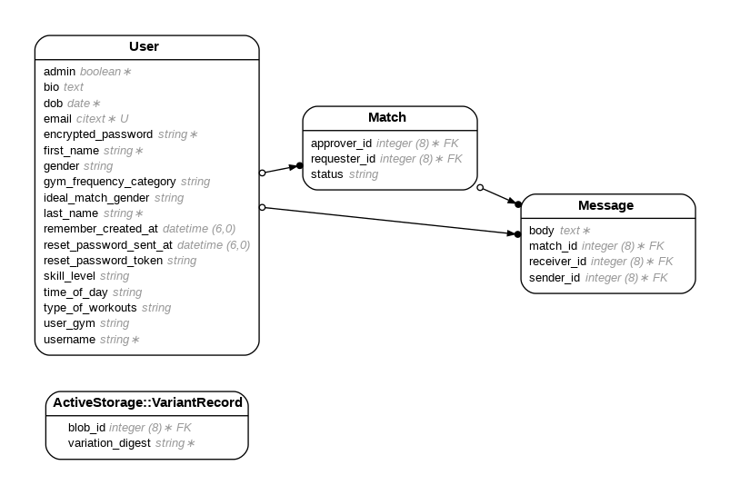

# GymBuds

GymBuds is a web application tailored for gym enthusiasts looking to find and connect with workout partners who share similar fitness interests and schedules. Utilizing a matching algorithm similar to Tinder"s, GymBuds offers a user-friendly platform for users to find their ideal gym buddy.

Access the app here: https://gymbuds.co/

<%= content_tag :iframe, nil, src: "https://player.vimeo.com/video/940901549", width: 640, height: 360, frameborder: 0, allowfullscreen: true %>

## Table of Contents

- [Main Features](#main-features)
- [Demo Video](#demo-video)
- [Entity Relationship Diagram](#entity-relationship-diagram)
- [Technologies Used](#technologies-used)
- [Services Used](#services-used)
- [Installation](#installation)
- [Contribution Guidelines](#contribution-guidelines)
- [FAQ](#faq)

## Main Features

**Match Making Algorithm**: GymBuds" matching algorithm pairs users based on their fitness goals, preferred workout times, and favorite gym locations.

**In-App Messaging**: Enables users to communicate with their matches directly within the app to coordinate and plan workouts.

**Profile Customization**: Users can personalize their profiles with details like fitness level, workout preferences, and available times.

## Demo Video

Check out the demo video of how GymBuds works and see it in action:

[Watch the Demo Video](https://player.vimeo.com/video/940901549)

## Entity Relationship Diagram

Below is the ERD of our application, illustrating how the various models are interconnected:



## Technologies Used

- **Ruby on Rails**: The server-side web application framework used for structured and efficient web app development.
- **PostgreSQL**: The relational database system providing robust data storage solutions for user data and interactions.
- **Bootstrap**: For responsive and modern UI components.

## Services Used

- **AWS S3**: Stores static files and user-uploaded content, such as profile pictures and videos.

## Installation

### Setting Up AWS S3 and Secure Credentials

1. **Generate a Master Key**
   If you do not already have a `master.key` file, you can generate one by running:
   ```bash
   EDITOR="code --wait" rails credentials:edit
   ```
   This command will open the credentials file in Visual Studio Code (replace `"code --wait"` with your preferred editor), and a new `master.key` file will be generated automatically if it does not exist.

2. **Add Service API Tokens**
   Inside the opened credentials file, add your API tokens and other sensitive configuration variables in a structured format. For example:
   ```yaml
   aws:
     access_key_id: YOUR_AWS_ACCESS_KEY_ID
     secret_access_key: YOUR_AWS_SECRET_ACCESS_KEY
   ```
   Save and close the file. The changes will be encrypted and saved securely, accessible only via the `master.key`.

3. **Ensure the Security of the Master Key**
   Never commit your `master.key` or the credentials file to version control. Add the `master.key` to your `.gitignore` file to prevent it from being accidentally pushed to your repository:
   ```bash
   echo "config/master.key" >> .gitignore
   ```

### App Setup

**Current Main Branch: Rails 7 + esbuild**

1.  **Run the following commands to set up the app**
   ```
   bundle install
   rails db:create
   rails db:migrate
   rake sample_data 
   bin/dev
   ```

Sign in with:
- **Email**: `sean@example.com`
- **Password**: `password`

## Contribution Guidelines

We welcome contributions from the community. Here are some guidelines to help you get started:

1. **Fork** the repository on GitHub.
2. **Clone** the project to your own machine.
3. **Commit** changes to your own branch.
4. **Push** your work back up to your fork.
5. Submit a **Pull Request** so that we can review your changes

**NOTE**: Be sure to merge the latest from "upstream" before making a pull request!

## FAQ

**Q: How do I reset my password?**

A: Navigate to the login page and click on "Forgot password?" to receive reset instructions via email.

**Q: Can I update my fitness goals and gym preferences?**

A: Yes, you can adjust your profile settings anytime to update your fitness goals, workout preferences, and preferred gym locations.

**Q: What should I do if I encounter a bug?**

A: If you find a bug, please report it by creating an issue on GitHub. Provide a detailed description of the bug and steps to reproduce it.
